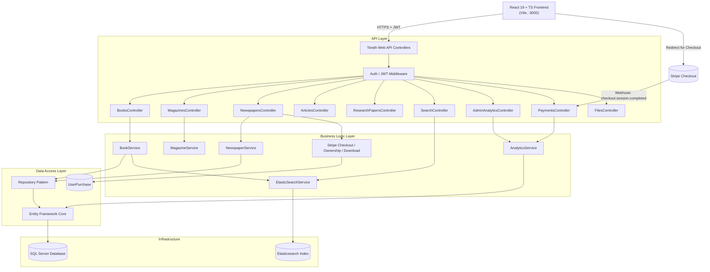
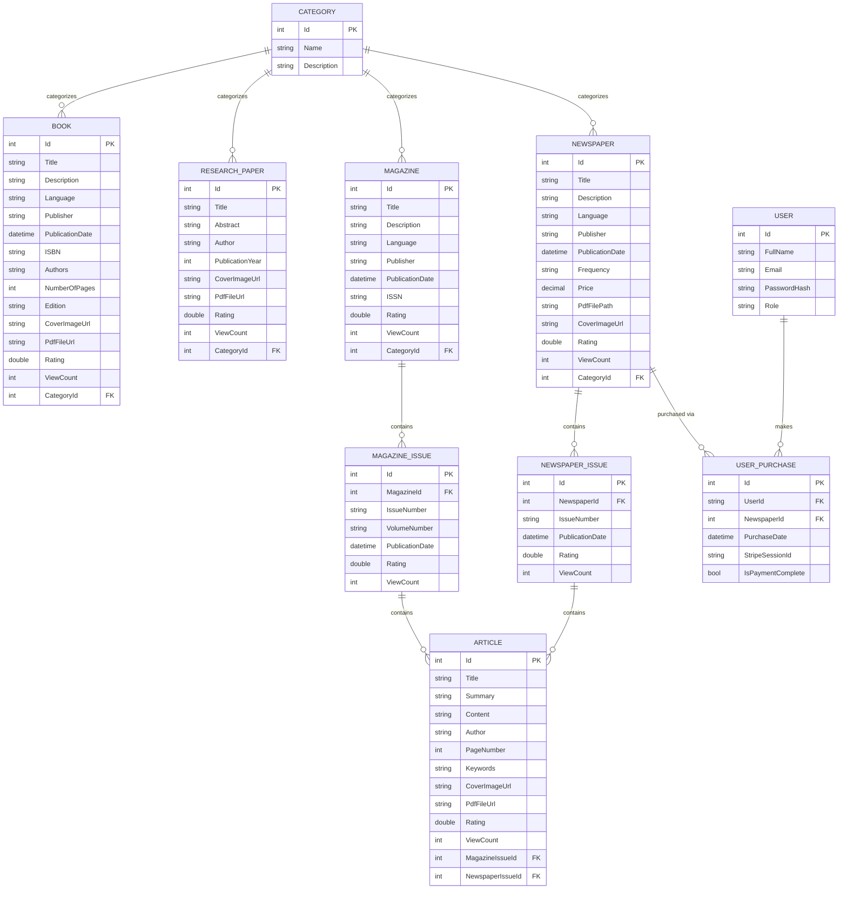

# Torath — Digital Heritage Library & Full-Stack Platform

Torath (تراث) is an enterprise-grade digital library management system and
unified search platform, now spanning a complete stack: a .NET 8 Web API
backend and a React 19 + TypeScript frontend. Built to handle diverse
historical and academic media, the platform provides robust content
management, role-based access control, dynamic pagination, high-performance
full-text search, engagement metrics (ratings & views), an admin analytics
dashboard, and paid-content delivery via Stripe for newspaper downloads.

------------------------------------------------------------------------

## 📚 Supported Content Types

The system relies on a shared base-entity architecture, supporting the
following media types. Every type now also carries **Rating** and
**ViewCount** for engagement tracking.

- **Books** — cover image, PDF file, ISBN, Authors, Page count, Edition
- **Research Papers** — abstract, author, publication year, cover image, PDF
- **Magazines & Magazine Issues** — relational issue tracking per
  publication; Magazines carry cover image + PDF
- **Newspapers & Newspaper Issues** — daily/weekly periodical tracking;
  Newspapers are **paid content** (see Payments below) with cover image + PDF
- **Articles** — individual text records, linked to a Magazine Issue *or*
  a Newspaper Issue (never both); cover image + PDF supported
- **Categories** — flat tagging shared across all content types

------------------------------------------------------------------------

## 🛠️ Technologies Used

### Backend
- **Framework:** .NET 8, ASP.NET Core Web API
- **Language:** C#
- **Database:** Microsoft SQL Server
- **ORM:** Entity Framework Core (EF Core)
- **Search Engine:** Elasticsearch (via Elastic.Clients.Elasticsearch)
- **Authentication:** JWT (JSON Web Tokens) with Role-Based Authorization
  (User, Admin) — tokens valid for 1 day
- **Payments:** Stripe (`Stripe.net` v52.2.0) — Checkout Sessions + webhooks
- **Testing:** xUnit, Moq, FluentAssertions

### Frontend
- **Framework:** React 19 + TypeScript, built with Vite
- **Routing:** React Router 6 (route-based code splitting throughout)
- **Server state:** TanStack Query (caching, invalidation, optimistic
  updates on create/delete)
- **Client state:** Zustand (auth/session only — everything else is
  server state or local component state)
- **Forms & validation:** React Hook Form + Zod
- **Styling:** Tailwind CSS, custom design tokens (CSS variables, light/dark)
- **Animation:** Framer Motion (page transitions, stagger grids, reduced-
  motion aware throughout)
- **Charts:** Recharts (admin analytics, lazy-loaded)
- **Image cropping:** react-image-crop (cover image uploads)
- **HTTP:** Axios, with a JWT request interceptor and a 401 → session-
  expired global handler

------------------------------------------------------------------------

## 📂 Project Structure

### Backend (`Torath/`)
- `Controllers/`: Incoming HTTP requests and API routing, including
  `PaymentsController` (Stripe webhook) and the analytics endpoints
- `Services/`: Core business logic, Elasticsearch mapping, Stripe Checkout
  session creation, data validation
- `Repositories/`: Generic and specific data access patterns (`IRepository<T>`)
- `Entities/`: EF Core database models, including `UserPurchase` (tracks
  Stripe payment state per user/newspaper)
- `DTOs/`: Data Transfer Objects for controlled API requests (Write) and
  responses (Read) — note several entities' Read DTOs differ meaningfully
  from their Write DTOs (see **API Reference** below)
- `SearchModels/`: Unified `SearchDocument` schema for Elasticsearch indexing
- `Torath.Tests/`: Automated unit, validation, and endpoint testing suite

### Frontend (`torath-frontend/`)
Feature-sliced, not type-sliced — each content domain owns its full stack:

```
src/
├── app/                    # Router, layouts (Public/Admin/Auth), providers, route guards
├── features/
│   ├── books/               # api/, hooks/, pages/, types.ts — repeated per entity
│   ├── magazines/
│   ├── newspapers/          # includes checkout/download/ownership + payment analytics
│   ├── articles/
│   ├── research-papers/
│   ├── categories/
│   ├── search/
│   ├── auth/                 # login/register, JWT decode, Zustand session store
│   └── admin/                 # dashboard, general analytics, search-index rebuild
├── components/
│   ├── ui/                    # Button, Card — shadcn-style primitives
│   ├── shared/                # AccessionTag, CoverImage, RatingBadge/Input, ImageCropModal,
│   │                          # AdminTable, ContentCard, Carousel, BackgroundSection, etc.
│   └── motion/                # FadeIn, StaggerGrid, PageTransition
├── lib/                      # Axios client, JWT decode, QueryClient singleton, error normalization
├── types/                    # Shared cross-feature types (ContentType, PaginatedResponse)
└── assets/backgrounds/       # Optimized photography used throughout the site
```

------------------------------------------------------------------------

## 🎨 Frontend Design System

A deliberate visual identity, not a default template — see the design docs
in-repo for full rationale. In brief:

- **Palette:** cool stone/limestone base, desaturated brass accent, nile
  (teal) for info states, clay for destructive actions only — full
  light/dark theming via CSS custom properties
- **Type:** Fraunces (display, 24px+ only) paired with Inter (UI/body);
  Noto Naskh Arabic / IBM Plex Sans Arabic for Arabic-language content
- **Signature element:** the **Accession Tag** (`BK·0231`, `RP·0089`) — a
  real content-type prefix + real database ID rendered like an archival
  inventory mark, present on every card and detail page
- **Motion:** page transitions, staggered grid reveals, card hover-lift +
  brass glow — all `prefers-reduced-motion`-aware

------------------------------------------------------------------------

## ⚙️ Configuration

### 1. SQL Server

```json
{
  "ConnectionStrings": {
    "DefaultConnection": "Server=YOUR_SERVER_NAME;Database=TorathDb;Trusted_Connection=True;MultipleActiveResultSets=true;TrustServerCertificate=true"
  }
}
```

### 2. Elasticsearch

```json
{
  "ElasticsearchSettings": {
    "Uri": "http://localhost:9200",
    "DefaultIndex": "torath_content"
  }
}
```

> **Note:** Rating and ViewCount are **not** indexed in Elasticsearch —
> `/api/Search` results cannot be sorted by either. Sorting by rating/views
> is only available on the dedicated entity list endpoints and the admin
> analytics endpoints, which query SQL Server directly.

### 3. Stripe

```json
{
  "Stripe": {
    "SecretKey": "sk_test_...",
    "WebhookSecret": "whsec_..."
  }
}
```

Requires the Stripe CLI running locally to forward webhook events during
development:

```bash
stripe listen --forward-to https://localhost:7231/api/payments/webhook
```

### 4. CORS

Configured for both common local dev ports, with `Content-Disposition`
explicitly exposed so the frontend can read the download filename:

```csharp
builder.Services.AddCors(options => options.AddPolicy("AllowFrontend", policy =>
    policy.WithOrigins("http://localhost:5173", "http://localhost:3000")
          .AllowAnyHeader()
          .AllowAnyMethod()
          .WithExposedHeaders("Content-Disposition")));
```

### 5. Frontend environment

```bash
# torath-frontend/.env
VITE_API_BASE_URL=https://localhost:7231
```

> **Important:** the frontend dev server **must** run on port **3000**,
> not Vite's default 5173. Stripe's checkout success/cancel URLs are
> hardcoded server-side to `http://localhost:3000/...` — this is already
> set in `vite.config.ts`.

------------------------------------------------------------------------

## 🚀 How to Run

### Backend

```bash
dotnet restore
dotnet build
dotnet run --project Torath
# Swagger: https://localhost:7231/swagger
```

In a second terminal, keep the Stripe listener running for payment testing:

```bash
stripe listen --forward-to https://localhost:7231/api/payments/webhook
```

### Frontend

```bash
cd torath-frontend
npm install
cp .env.example .env      # point VITE_API_BASE_URL at the backend above
npm run dev                # serves on http://localhost:3000
```

### Full local test loop
1. Backend + Stripe listener running
2. Frontend running on `:3000`
3. Register a user via the app, then promote them to Admin directly in SQL
   Server (`UPDATE Users SET Role = 'Admin' WHERE Email = '...'`) — there is
   no role-assignment endpoint
4. Log in, browse, rate, and (for Newspapers) test the full Buy → Stripe
   Checkout → redirect → download flow with Stripe's test card
   `4242 4242 4242 4242`

------------------------------------------------------------------------

## 🗄️ Applying EF Core Migrations

```bash
dotnet ef database update --project Torath
```

------------------------------------------------------------------------

## 🧪 How to Test the APIs

```bash
dotnet test --logger "html;LogFileName=TestReport.html" --results-directory "./TestResults"
```

Report generated at `./TestResults/TestReport.html`.

------------------------------------------------------------------------

## 🔍 Search API Examples

```http
GET /api/Search?Query=Egypt
GET /api/Search?Query=Pyramids&PageNumber=2&PageSize=15
GET /api/Search?Query=History&ContentType=Book&CategoryId=4
```

Each result includes both a composite Elasticsearch `id` (e.g. `"Book_4001"`)
and a `databaseId` (the real numeric SQL id) — use `databaseId` for routing
to a detail page.

------------------------------------------------------------------------

## ⭐ Ratings & Views

Available on Books, Magazines, Newspapers, Articles, and Research Papers.

```http
POST /api/{Entity}/{id}/view
```
No auth required, no request body. Fired once per detail-page load on the
frontend (not on card click, to avoid double-counting a single visit that
clicks through to the detail page).

```http
POST /api/{Entity}/{id}/rate
Content-Type: application/json

4.5
```
Requires User/Admin auth. Body is a **raw double**, not a wrapped object —
e.g. send `4.5`, not `{"rating": 4.5}`.

------------------------------------------------------------------------

## 📊 Admin Analytics

### General dashboard

```http
GET /api/admin/analytics
```
Admin-only. Returns:
```json
{
  "totalViews": 0,
  "totalItems": 0,
  "topViewed": [{ "id": 0, "title": "", "type": "Book", "viewCount": 0, "rating": 0 }],
  "topRated":  [{ "id": 0, "title": "", "type": "Book", "viewCount": 0, "rating": 0 }]
}
```
`topViewed` and `topRated` are independently queried (top 10 per content
type by their respective metric, pooled and re-sorted) — `topRated` is a
true catalog-wide top-10-by-rating, not derived from `topViewed`.

### Newspaper payment metrics

```http
GET /api/Newspapers/admin/analytics
```
Admin-only. Returns:
```json
{ "totalDownloads": 0, "totalRevenue": 0.00 }
```

------------------------------------------------------------------------

## 💳 Newspaper Payments (Stripe)

Newspapers are gated content — browsing and metadata are free, but the PDF
requires purchase.

```http
POST /api/Newspapers/{id}/checkout          # auth required
```
Creates a Stripe Checkout Session and returns `{ "url": "https://checkout.stripe.com/..." }`.
Returns `400` with `"You already own this newspaper."` if already purchased.
`Price` is passed directly to Stripe as the line item amount.

Redirects (hardcoded, not configurable per environment):
- Success → `http://localhost:3000/newspapers/{id}?success=true`
- Cancel → `http://localhost:3000/newspapers/{id}?canceled=true`

```http
POST /api/payments/webhook
```
Stripe webhook receiver. On `checkout.session.completed`, marks the
matching `UserPurchase.IsPaymentComplete = true`.

```http
GET /api/Newspapers/{id}/download           # auth required
```
Returns raw PDF bytes (`Content-Type: application/pdf`, `Content-Disposition: attachment`)
if the caller has purchased the newspaper or is an Admin. `403 Forbidden`
otherwise.

```http
GET /api/Newspapers/{id}/ownership          # User/Admin auth required
```
Returns `{ "isOwned": true|false }` — checks the `UserPurchases` table only
(does **not** account for the Admin bypass; the frontend skips this check
for Admins and shows the download option directly).

------------------------------------------------------------------------

## 📁 File Uploads

```http
POST /api/Files/upload-image      # multipart/form-data, key "file" → { "url": "/uploads/images/..." }
POST /api/Files/upload-pdf        # multipart/form-data, key "file" → { "url": "/uploads/pdfs/..." }
DELETE /api/Files/delete-file?fileUrl=...
```

⚠️ **Known limitation, not yet resolved:** uploaded files (including
Newspaper PDFs gated by `/download`) are currently served from `wwwroot`,
which ASP.NET's static file middleware serves publicly by default. Anyone
who learns the direct file URL can bypass the `/download` paywall entirely.
**Action needed:** move paid assets outside `wwwroot` (or otherwise restrict
static file serving for that path) so `/download` is the only access path.

------------------------------------------------------------------------

## 🏗️ Architecture Diagram



------------------------------------------------------------------------

## 🗃️ Entity-Relationship Diagram (ERD)



------------------------------------------------------------------------

## 📝 Notable API Design Notes (for frontend/backend integration)

- **Read DTOs are not uniform with Write DTOs.** Several entities' read
  responses differ meaningfully from what's accepted on write (e.g. Book
  read returns `publicationYear` derived from the stored `publicationDate`,
  not the date itself; Category is flattened to `categoryName` on some
  entities' reads but returned as a nested object on others). Always
  verify a real response body rather than assuming symmetry with the
  Write DTO.
- **Pagination envelope** is consistent across every list endpoint:
  `{ data, totalRecords, pageNumber, pageSize }`.
- **No list endpoint accepts a sort parameter** other than `/api/Search`'s
  `SortBy`/`SortDescending` (which itself can't sort by rating/views, since
  those aren't indexed in Elasticsearch). Sorting by rating/views elsewhere
  is page-local, computed client-side on whatever page is currently loaded.
- **Categories, Magazine/Newspaper Issues** have no `createdDate`/
  `updatedDate` fields at all.
