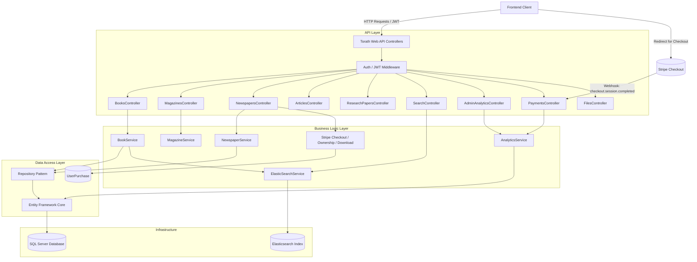
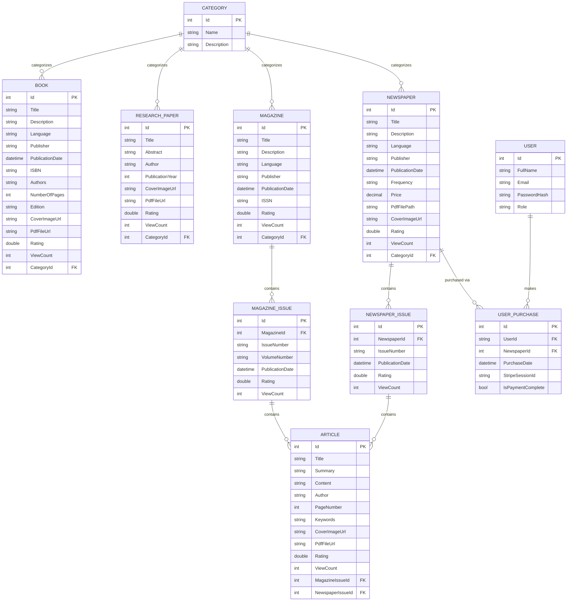

# Torath API

Torath is an enterprise-grade digital library management system and
unified search backend. Built to handle diverse historical and academic
media, the platform provides robust content management, role-based
access control, dynamic pagination, high-performance full-text search
indexing, engagement metrics (ratings & views), an admin analytics
dashboard, and paid-content delivery via Stripe for newspaper downloads.

------------------------------------------------------------------------

## 📚 Supported Content Types

The system relies on a shared base-entity architecture, supporting the
following media types. Every type now also carries **Rating** and
**ViewCount** for engagement tracking.

- **Books** — cover image, PDF file, ISBN, Authors, Page count, Edition
- **Research Papers** — abstract, author, publication year, cover image, PDF
- **Magazines & Magazine Issues** — relational issue tracking per
  publication; Magazines carry cover image + PDF
- **Newspapers & Newspaper Issues** — daily/weekly periodical tracking;
  Newspapers are **paid content** (see Payments below) with cover image + PDF
- **Articles** — individual text records, linked to a Magazine Issue *or*
  a Newspaper Issue (never both); cover image + PDF supported
- **Categories** — flat tagging shared across all content types

------------------------------------------------------------------------

## 🛠️ Technologies Used

- **Framework:** .NET 8, ASP.NET Core Web API
- **Language:** C#
- **Database:** Microsoft SQL Server
- **ORM:** Entity Framework Core (EF Core)
- **Search Engine:** Elasticsearch (via Elastic.Clients.Elasticsearch)
- **Authentication:** JWT (JSON Web Tokens) with Role-Based Authorization
  (User, Admin) — tokens valid for 1 day
- **Payments:** Stripe (`Stripe.net` v52.2.0) — Checkout Sessions + webhooks
- **Testing:** xUnit, Moq, FluentAssertions

------------------------------------------------------------------------

## 📂 Project Structure

The solution follows a clean, decoupled architecture:

- `Controllers/`: Incoming HTTP requests and API routing, including
  `PaymentsController` (Stripe webhook) and the analytics endpoints
- `Services/`: Core business logic, Elasticsearch mapping, Stripe Checkout
  session creation, data validation
- `Repositories/`: Generic and specific data access patterns (`IRepository<T>`)
- `Entities/`: EF Core database models mapped to SQL Server tables,
  including `UserPurchase` (tracks Stripe payment state per user/newspaper)
- `DTOs/`: Data Transfer Objects for controlled API requests (Write) and
  responses (Read) — note several entities' Read DTOs differ meaningfully
  from their Write DTOs (see **Notable API Design Notes** below)
- `SearchModels/`: Unified `SearchDocument` schema for Elasticsearch indexing
- `Torath.Tests/`: Automated unit, validation, and endpoint testing suite

------------------------------------------------------------------------

## ⚙️ Configuration

### 1. SQL Server

Ensure SQL Server is running locally or remotely. Update the
`DefaultConnection` string inside `appsettings.json` or
`appsettings.Development.json`:

```json
{
  "ConnectionStrings": {
    "DefaultConnection": "Server=YOUR_SERVER_NAME;Database=TorathDb;Trusted_Connection=True;MultipleActiveResultSets=true;TrustServerCertificate=true"
  }
}
```

### 2. Elasticsearch

Ensure your Elasticsearch instance is running (default port is usually
9200). Update the URI in `appsettings.json`:

```json
{
  "ElasticsearchSettings": {
    "Uri": "http://localhost:9200",
    "DefaultIndex": "torath_content"
  }
}
```

> **Note:** Rating and ViewCount are **not** indexed in Elasticsearch —
> `/api/Search` results cannot be sorted by either. Sorting by rating/views
> is only available on the dedicated entity list endpoints and the admin
> analytics endpoints, which query SQL Server directly.

### 3. Stripe

```json
{
  "Stripe": {
    "SecretKey": "sk_test_...",
    "WebhookSecret": "whsec_..."
  }
}
```

Requires the Stripe CLI running locally to forward webhook events during
development:

```bash
stripe listen --forward-to https://localhost:7231/api/payments/webhook
```

### 4. CORS

Configured for local frontend dev origins, with `Content-Disposition`
explicitly exposed so a browser client can read the download filename:

```csharp
builder.Services.AddCors(options => options.AddPolicy("AllowFrontend", policy =>
    policy.WithOrigins("http://localhost:5173", "http://localhost:3000")
          .AllowAnyHeader()
          .AllowAnyMethod()
          .WithExposedHeaders("Content-Disposition")));
```

> Stripe's checkout success/cancel redirect URLs are currently hardcoded
> to `http://localhost:3000/...` (see **Payments** below) rather than
> configurable per environment — update this if the frontend origin
> changes.

------------------------------------------------------------------------

## 🚀 How to Run the API

1. Open your terminal in the root directory.

2. Restore packages:

   ```bash
   dotnet restore
   ```

3. Build:

   ```bash
   dotnet build
   ```

4. Run:

   ```bash
   dotnet run --project Torath
   ```

5. Open Swagger (usually `https://localhost:7231/swagger`).

6. In a second terminal, keep the Stripe listener running to receive
   webhook events during local payment testing:

   ```bash
   stripe listen --forward-to https://localhost:7231/api/payments/webhook
   ```

------------------------------------------------------------------------

## 🗄️ Applying EF Core Migrations

```bash
dotnet ef database update --project Torath
```

------------------------------------------------------------------------

## 🧪 How to Test the APIs

```bash
dotnet test --logger "html;LogFileName=TestReport.html" --results-directory "./TestResults"
```

The report will be generated at:

`./TestResults/TestReport.html`

------------------------------------------------------------------------

## 🔍 Search API Examples

**Basic Keyword Search**

```http
GET /api/Search?Query=Egypt
```

**Paginated Search**

```http
GET /api/Search?Query=Pyramids&PageNumber=2&PageSize=15
```

**Filtered Search**

```http
GET /api/Search?Query=History&ContentType=Book&CategoryId=4
```

Each result includes both a composite Elasticsearch `id` (e.g. `"Book_4001"`)
and a `databaseId` (the real numeric SQL id) for consumers that need to
route to the underlying record.

------------------------------------------------------------------------

## ⭐ Ratings & Views

Available on Books, Magazines, Newspapers, Articles, and Research Papers.

```http
POST /api/{Entity}/{id}/view
```
No auth required, no request body. Intended to be called once per detail
view (not per card impression), to avoid inflating counts.

```http
POST /api/{Entity}/{id}/rate
Content-Type: application/json

4.5
```
Requires User/Admin auth. Body is a **raw double**, not a wrapped object —
send `4.5`, not `{"rating": 4.5}`.

------------------------------------------------------------------------

## 📊 Admin Analytics

### General dashboard

```http
GET /api/admin/analytics
```
Admin-only. Returns:
```json
{
  "totalViews": 0,
  "totalItems": 0,
  "topViewed": [{ "id": 0, "title": "", "type": "Book", "viewCount": 0, "rating": 0 }],
  "topRated":  [{ "id": 0, "title": "", "type": "Book", "viewCount": 0, "rating": 0 }]
}
```
`topViewed` and `topRated` are independently queried (top 10 per content
type by their respective metric, pooled and re-sorted) — `topRated` is a
true catalog-wide top-10-by-rating, not derived from `topViewed`.

### Newspaper payment metrics

```http
GET /api/Newspapers/admin/analytics
```
Admin-only. Returns:
```json
{ "totalDownloads": 0, "totalRevenue": 0.00 }
```

------------------------------------------------------------------------

## 💳 Newspaper Payments (Stripe)

Newspapers are gated content — browsing and metadata are free, but the PDF
requires purchase.

```http
POST /api/Newspapers/{id}/checkout          # auth required
```
Creates a Stripe Checkout Session and returns
`{ "url": "https://checkout.stripe.com/..." }`. Returns `400` with
`"You already own this newspaper."` if already purchased. `Price` is
passed directly to Stripe as the line item amount.

Redirects (currently hardcoded, not configurable per environment):
- Success → `http://localhost:3000/newspapers/{id}?success=true`
- Cancel → `http://localhost:3000/newspapers/{id}?canceled=true`

```http
POST /api/payments/webhook
```
Stripe webhook receiver. On `checkout.session.completed`, marks the
matching `UserPurchase.IsPaymentComplete = true`.

```http
GET /api/Newspapers/{id}/download           # auth required
```
Returns raw PDF bytes (`Content-Type: application/pdf`,
`Content-Disposition: attachment`) if the caller has purchased the
newspaper or is an Admin. `403 Forbidden` otherwise.

```http
GET /api/Newspapers/{id}/ownership          # User/Admin auth required
```
Returns `{ "isOwned": true|false }` — checks the `UserPurchases` table
only; does **not** independently account for the Admin role bypass used
by `/download`.

------------------------------------------------------------------------

## 📁 File Uploads

```http
POST /api/Files/upload-image      # multipart/form-data, key "file" → { "url": "/uploads/images/..." }
POST /api/Files/upload-pdf        # multipart/form-data, key "file" → { "url": "/uploads/pdfs/..." }
DELETE /api/Files/delete-file?fileUrl=...
```

⚠️ **Known limitation, not yet resolved:** uploaded files (including
Newspaper PDFs gated by `/download`) are currently served from `wwwroot`,
which ASP.NET's static file middleware serves publicly by default. Anyone
who learns the direct file URL can bypass the `/download` paywall
entirely. **Action needed:** move paid assets outside `wwwroot` (or
otherwise restrict static file serving for that path) so `/download` is
the only access path to a purchased PDF.

------------------------------------------------------------------------

## 🏗️ Architecture Diagram



------------------------------------------------------------------------

## 🗃️ Entity-Relationship Diagram (ERD)



------------------------------------------------------------------------

## 📝 Notable API Design Notes

- **Read DTOs are not uniform with Write DTOs.** Several entities' read
  responses differ meaningfully from what's accepted on write (e.g. Book
  read returns `publicationYear` derived from the stored `publicationDate`,
  not the date itself; Category is flattened to `categoryName` on some
  entities' reads but returned as a nested object on others). Consumers
  should verify a real response body rather than assuming symmetry with
  the corresponding Write DTO.
- **Pagination envelope** is consistent across every list endpoint:
  `{ data, totalRecords, pageNumber, pageSize }`.
- **No list endpoint accepts a sort parameter** other than `/api/Search`'s
  `SortBy`/`SortDescending` (which itself can't sort by rating/views,
  since those aren't indexed in Elasticsearch).
- **Categories, Magazine/Newspaper Issues** have no `createdDate`/
  `updatedDate` fields at all.
- **`/api/Newspapers/{id}/ownership`** reflects purchase records only —
  Admins will show `isOwned: false` even though `/download` grants them
  access via role, not purchase history. Any client relying on this
  endpoint for UI state needs to special-case Admins separately.
