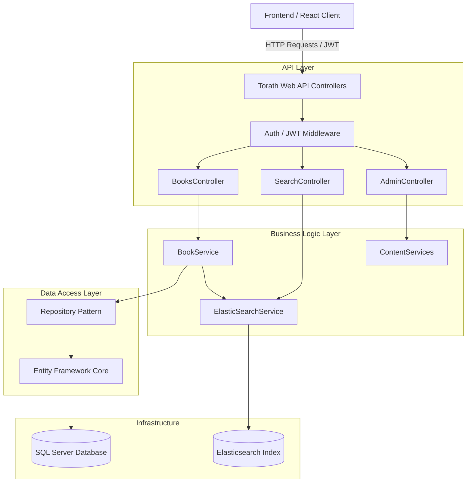
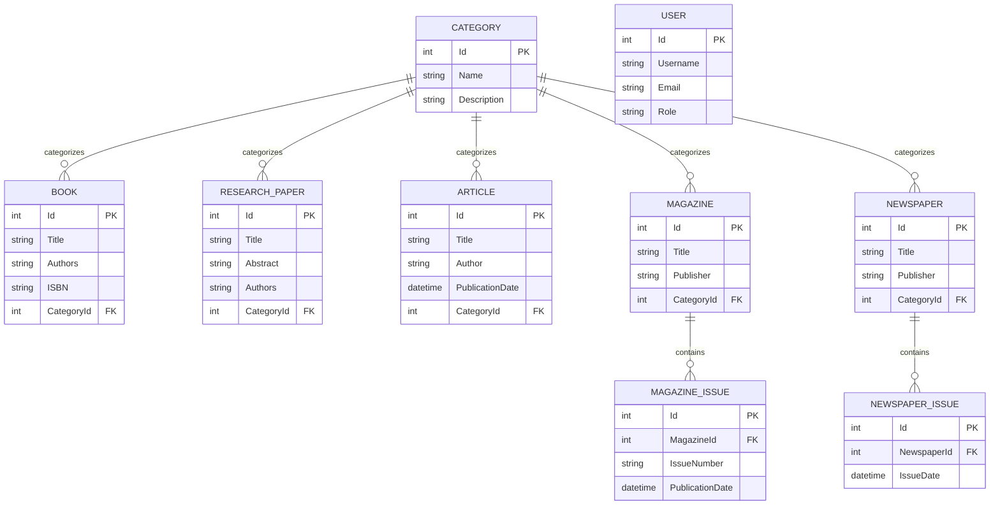

# Torath API

Torath is an enterprise-grade digital library management system and
unified search backend. Built to handle diverse historical and academic
media, the platform provides robust content management, role-based
access control, dynamic pagination, and high-performance full-text
search indexing.

------------------------------------------------------------------------

## 📚 Supported Content Types

The system relies on a shared base-entity architecture, supporting the
following media types:

-   **Books** (Includes media URLs for covers and PDF files)
-   **Research Papers** (Includes abstracts and specific author
    mappings)
-   **Magazines & Magazine Issues** (Relational issue tracking per
    publication)
-   **Newspapers & Newspaper Issues** (Daily/Weekly periodical tracking)
-   **Articles** (Individual text records)
-   **Categories** (Hierarchical tagging for all content types)

------------------------------------------------------------------------

## 🛠️ Technologies Used

-   **Framework:** .NET 8, ASP.NET Core Web API
-   **Language:** C#
-   **Database:** Microsoft SQL Server
-   **ORM:** Entity Framework Core (EF Core)
-   **Search Engine:** Elasticsearch (via Elastic.Clients.Elasticsearch)
-   **Authentication:** JWT (JSON Web Tokens) with Role-Based
    Authorization (User, Admin)
-   **Testing:** xUnit, Moq, FluentAssertions

------------------------------------------------------------------------

## 📂 Project Structure

The solution follows a clean, decoupled architecture:

-   `Controllers/`: Handles incoming HTTP requests and API routing.
-   `Services/`: Contains core business logic, Elasticsearch mapping,
    and data validation.
-   `Repositories/`: Generic and specific data access patterns
    (IRepository`<T>`{=html}).
-   `Entities/`: EF Core database models mapped to SQL Server tables.
-   `DTOs/`: Data Transfer Objects for controlled API requests (Write)
    and responses (Read).
-   `SearchModels/`: Unified document schemas (e.g., SearchDocument) for
    Elasticsearch indexing.
-   `Torath.Tests/`: Automated unit, validation, and endpoint testing
    suite.

------------------------------------------------------------------------

## ⚙️ Configuration

### 1. SQL Server Configuration

Ensure SQL Server is running locally or remotely. Update the
`DefaultConnection` string inside `appsettings.json` or
`appsettings.Development.json`:

``` json
{
  "ConnectionStrings": {
    "DefaultConnection": "Server=YOUR_SERVER_NAME;Database=TorathDb;Trusted_Connection=True;MultipleActiveResultSets=true;TrustServerCertificate=true"
  }
}
```

### 2. Elasticsearch Configuration

Ensure your Elasticsearch instance is running (default port is usually
9200). Update the URI in `appsettings.json`:

``` json
{
  "ElasticsearchSettings": {
    "Uri": "http://localhost:9200",
    "DefaultIndex": "torath_content"
  }
}
```

------------------------------------------------------------------------

## 🚀 How to Run the API

1.  Open your terminal in the root directory.

2.  Restore packages:

    ``` bash
    dotnet restore
    ```

3.  Build:

    ``` bash
    dotnet build
    ```

4.  Run:

    ``` bash
    dotnet run --project Torath
    ```

5.  Open Swagger (usually `https://localhost:7198/swagger`).

------------------------------------------------------------------------

## 🗄️ Applying EF Core Migrations

``` bash
dotnet ef database update --project Torath
```

------------------------------------------------------------------------

## 🧪 How to Test the APIs

``` bash
dotnet test --logger "html;LogFileName=TestReport.html" --results-directory "./TestResults"
```

The report will be generated at:

`./TestResults/TestReport.html`

------------------------------------------------------------------------

## 🔍 Search API Examples

**Basic Keyword Search**

``` http
GET /api/Search?Query=Egypt
```

**Paginated Search**

``` http
GET /api/Search?Query=Pyramids&PageNumber=2&PageSize=15
```

**Filtered Search**

``` http
GET /api/Search?Query=History&ContentType=Book&CategoryId=4
```

------------------------------------------------------------------------

## 🏗️ Architecture Diagram




---

## 🗃️ Entity-Relationship Diagram (ERD)


